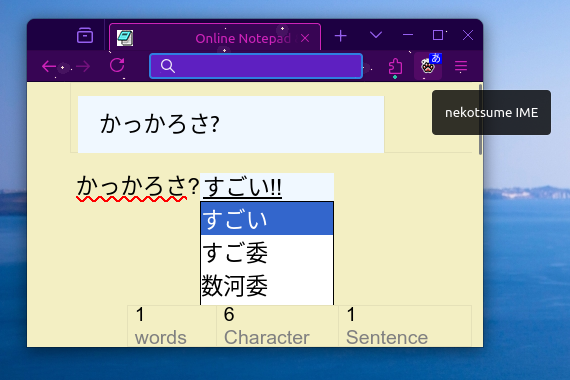

# nekotsume IME | ネコツメIME

_nekotsume IME_ is an efficient and privacy-friendly Japanese IME for (almost) any website in your web browser. It works fully locally: what you type is never sent on the Internet and stays private. With this, it's also pretty fast, and the suggestions dictionary should be decent.

<!-- TODO, complete: Features, Usage general/WebExtension/webpage -->

## Usage

General:

* You can toggle the IME to ON [あ] to enable conversion of for all standard text input fields (`<input type="text">` and `<textarea>`) of the current window, and to OFF [A] to disable conversion and write normally.
* When the IME is enabled, type lowecase latin letters to have them converted to hiragana characters. Press ENTER to accept a direct conversion, or press SPACE to show other options (kanji, etc.).

Browser Extension:

* The IME can be toggled ON and OFF by clicking the extension button in your browser's toolbar (for your comfort, please pin it). A textual tooltip indicates the current status of the IME: [あ] with blue background when enabled, [A] with gray background when disabled.

## Building from Source

The core code is not compiled and doesn't need to be. However, it uses open-source third-party dependencies that require their own build procedures for the following library files:

Require compilation, and can optionally be minified:

* `lib/igo.min.js`: igo-javascript, <https://github.com/shogo82148/igo-javascript>

Don't require any compilation, but can optionally be minified:

* `lib/zip.min.js`: zipjs, <https://github.com/shogo82148/zipjs>

To prepare the dependencies:

0. You will need a POSIX-compliant shell and NodeJS on your build system, and this repository cloned
1. Make sure to init Git submodules (or clone the above Git repositories in the `lib/` directory)
2. Manually follow the libraries' instructions to setup a build environment and complete the process
3. Copy the respective built files to the paths specified above

Alternatively, if requirements are met, you can just run the `build.sh` script and it should perform all the steps automatically, including building a ZIP/XPI file for the WebExtension distribution.

## Copyright Notice

_nekotsume IME_ is forked and readapted to work as a Web Extension from _IgoIME_ by shogo82148 (Ichinose Shogo): <https://github.com/shogo82148/IgoIME>. _IgoIME_ is based on _Ajax IME_ by taku (Taku Kudo).

They are not legally open-source, as _Ajax IME_ is available only under the terms of: `(C) Taku Kudo, all rights reserve rd. Personal use only!`

_nekotsume IME_ is only being distributed in good faith and in the spirit of the fair use doctrine, in the hopes that it can be useful, but without any warranty.

